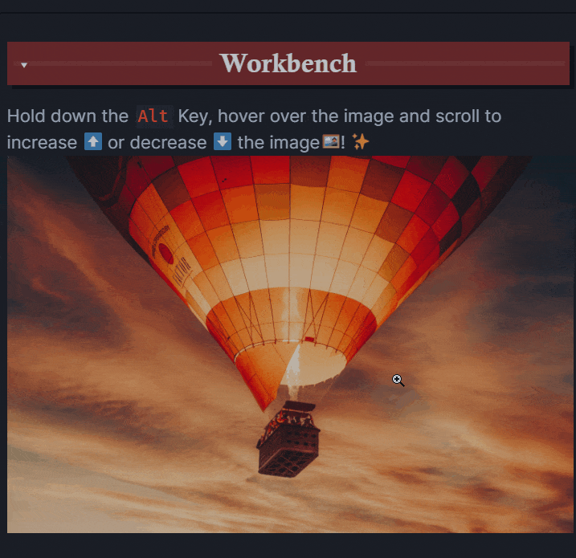

## Obsidian mousewheel image zoom

This plugin enables you to increase/decrease the size of an image by holding down a configurable key (defaults to 
left alt), hover over the image in preview mode and scrolling.

